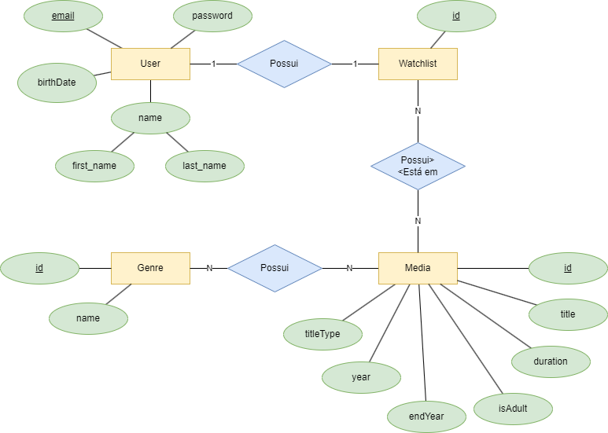
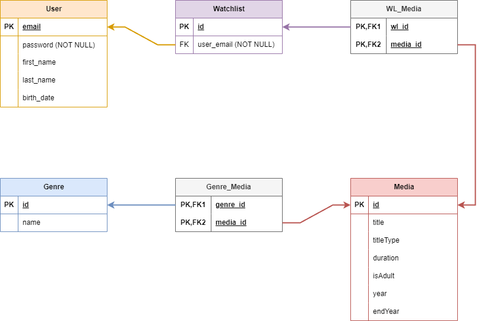
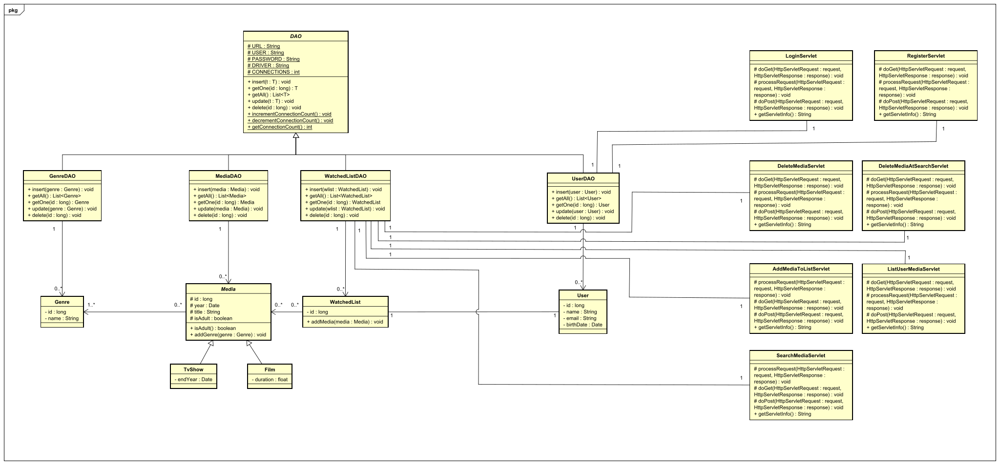

# ShowTracker

ShowTracker é uma aplicação desenvolvida dentro da disciplina de Banco de Dados I do cursos de Sistema e Mídias Digitais da UFC. Ela serve para um usuário guardar sua lista de filmes e séries assistidas.

Para construir a aplicação e deixá-la funcional foi utilizado o dataset 'title.basics.tsv.gz' do IMDb, com todas as informações de séries e filmes, disponível em: [https://developer.imdb.com/non-commercial-datasets/](https://developer.imdb.com/non-commercial-datasets/). Abaixo você vai encontrar instruções de como inserir esses dados no seu banco de dados local.

## Equipe Responsável

|  Nome                            |  Matrícula    |
|  :---                            |  ---:         |
|  Yanna Torres Gonçalves          |  507773       |
|  Ívina Lara de Sousa Rosa        |  507804       |
|  Samiris Sampaio de Albuquerque  |  509735       |

Apoio de:
* João Victor Barroso Alves
* Vládia Helen Ferreira Faria

---

## Modelagem do Banco de Dados

### Modelo Entidade-Relacionamento (MER) do Banco de Dados
  

### Modelo Relacional do Banco de Dados
  

## Diagrama de Classes

---

## Especificações Técnincas

O projeto foi feito utilizando Java 17 como back-end e HTML, CSS e JavaScript para o front-end.

Para o banco de dados foi utilizado o PostgreSQL, como instruído dentro da cadeira.

---

## Criação do Banco de Dados e Inserção dos Dados

**ATENÇÃO:** Caso seu usuário seja diferente de _**postgres**_ e a sua senha seja diferente de _**ufc123**_, por favor altere as informações correspondentes dentro da classe DAO no seguinte arquivo: [DAO.java](./src/java/repository/DAO.java).

1. Crie um banco de dados com o nome 'movies' através do pgAdmin4
   
2. Para criar o banco de dadaos use o Script DDL disponível no seguinte arquivo: [schema-movies.sql](https://drive.google.com/file/d/1wfqSEpKOyFAJUS3HFEACgNvjr4dO4Q62/view?usp=drive_link)

3. Já para inserir os dados iniciais de filmes e gêneros, para que a aplicação tenha de fato alguma utilidade, use o Script DML no seguinte arquivo: [instancia-movies.sql](https://drive.google.com/file/d/14lZ-pcnWNDa58BSzD7IACOzuTWoKLGAU/view?usp=drive_link)

**OBS:** esse passo é de extrema importância, pois sem ele a aplicação não terá nenhuma funcionalidade prática, pois não terão filmes nem séries para pesquisar e adicionar à lista de assistidos.

**OBS2:** por serem muitos dados, esse passo pode demorar para ser completado.
